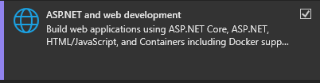
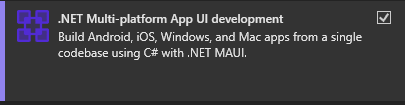
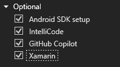
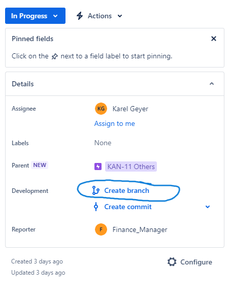
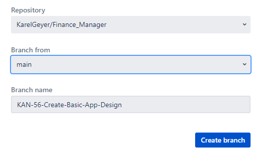

# Finance Manager repository

## Table of contents

  
Table of Contents

  <ol>
    <li><a href="#about-the-project">About the project</a></li>
    <li><a href="#technologies">Technologies</a></li>
    <li><a href="#getting-started">Getting Started</a></li>
    <li><a href="#contributing">Contributing</a></li>
    <li><a href="#roadmap">Roadmap</a></li>
    <li><a href="#contact">Contact</a></li>
  </ol>

## About The Project

Finance manager is a project that allows to:

1.  Manage monthly budget
2.  Manage expenses tracking
3.  Manage couples or families finance with splitting the cost based on the chosen preference
4.  Keep track of users properties and investments, should they add their values
5.  Keep track of users income
6.  Set up financial goals

The is to have a software provided through several stores for free and that will be available for following platforms:

- Windows
- Android
- MacOS
- iOS
- Web?

## Technologies

- [.NET](https://dotnet.microsoft.com/en-us/) for microservices
- [MAUI](https://dotnet.microsoft.com/en-us/apps/maui) for desktop layer
- [Xamarin](https://learn.microsoft.com/cs-cz/xamarin/get-started/what-is-xamarin) for mobile layer integrated into MAUI framework
- [MimeKit](https://mimekit.net/) as a mail client
- [MSSQL](https://www.microsoft.com/cs-cz/sql-server/sql-server-2019) as a database layer

## Getting Started

- First you will need account made for you for JIRA and you will also need access to DB in case you will be handeling it as well.
- To be invited to JIRA, contant one of the app administrator -> <a href="#contributing">Contributing</a>
- Most of what we worked with is managed by microsoft so I strongly recomend using [Visual Studio IDE](https://visualstudio.microsoft.com/) as it offers great support, though ofcourse, any IDE will work just fine. This documentation if altought written with VS
- You need to clone the project from github with `git clone`
- depending on which part of the project you will be working on, you will need to install several things:
  <strong>Visual Studio</strong>
  1. <strong>Web API development</strong> - You will need at least VS version 17.8 or higher as we user .NET 8.0 - Essentially all you have to do is run Visual Studio Installer - Check ASP.NET and web development tile and install whatever is set by default
      - You will also need a secret in order to be able to work with our DB provider, in order to do so, right click on service you wish to work on, find Manager User Secrets:
     `{
  "Supabase:Key": "key"
}` and provide a key. In order to retrieve the key, contact one on of the project admins.
  2. <strong>Desktop/Wep app development</strong> (iOS, Android, MacOS)
     - For Devs that wants to work on support for mobile or MaxOS version
     - Similarly to above but check the .NET Multiplatform App UI Development
       
     - Make sure to check Xamarin in Optional
       

## Contributing

First of all, thank you very much for any contribution you have done for this project, be sure it is valued just like it possibly helps you get some experience with project's tech stack.

After you have completed the steps from <a href="#getting-started">Section above</a>, the rules are quite simple. Choose a task to do, assign it to yourself and create a branch. Also please do not forget to update the status of the task to "In Progress" status so we know it being solved.
 
When you are done with your work, make sure to create a short descriptive commit and push your changes to the repository. We manage our commits and PR's based on [this article](https://support.atlassian.com/jira-software-cloud/docs/reference-issues-in-your-development-work/) as we have a JIRA integration in our Github repository. After you create your Pull Request, assign one of the experienced developers for code review and change status of the task to "Code Review" and asign the task to the person responsible for the code review.
If the PR is accepted, it will be merged into the main branch. Code reviewer can also reject the PR and ask for changes in the code before it is accepted. In that case the code reviewer will change the task status back to "In progress" and asign it back to you.

Also please keep in mind that we are trying to write as many unit tests as possible and we would like to have a full coverage on backend. Every backend and helper service that is not frontend needs to have its own unit test project and at least 70% coverage.

## Roadmap

- [ ] Add basic setup files, create project folder structure
- [ ] Build a Database
- [ ] Add .NET Web API with Microservices architecture
- [ ] Add Frontend
  - [ ] Desktop version of application
    - [ ] Windows
    - [ ] MacOS
  - [ ] Mobile version of application
    - [ ] Android
    - [ ] iOS
  - [ ] Add Web version of application
  - [ ] Allow Excel exports
  - [ ] Multilanguage support
    - [ ] Czech
    - [ ] English
    - [ ] Portuguese
    - [ ] Korean

## Contact

Karel Geyer - karelgeyer@gmail.com
Honza Phan - honzaphan98@gmail.com
