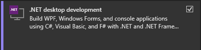

# Finance Manager repository

## Table of contents

  
Table of Contents

  <ol>
    <li><a href="#about-the-project">About the project</a></li>
    <li><a href="#technologies">Technologies</a></li>
    <li><a href="#getting-started">Getting Started</a></li>
    <li><a href="#contributing">Contributing</a></li>
    <li><a href="#roadmap">Roadmap</a></li>
    <li><a href="#contact">Contact</a></li>
  </ol>

## About The Project

Finance manager is a project that allows to:

1.  Manage monthly budget
2.  Manage expenses tracking
3.  Manage couples or families finance with splitting the cost based on the chosen preference
4.  Keep track of users properties and investments, should they add their values
5.  Keep track of users income
6.  Set up financial goals

The is to have a software provided through several stores for free and that will be available for following platforms:

- Windows
- Android
- MacOS?
- iOS
- Web?

## Technologies

- [.NET](https://dotnet.microsoft.com/en-us/) for microservices
- [WPF .NET](https://learn.microsoft.com/en-us/dotnet/desktop/wpf/?view=netdesktop-8.0) for desktop layer
- [Xamarin](https://learn.microsoft.com/cs-cz/xamarin/get-started/what-is-xamarin) for mobile layer and macOS
- [MimeKit](https://mimekit.net/) as a mail client
- [MSSQL](https://www.microsoft.com/cs-cz/sql-server/sql-server-2019) as a database layer
- [SQL Server Management Studio](https://learn.microsoft.com/en-us/sql/ssms/sql-server-management-studio-ssms?view=sql-server-ver16)

## Getting Started

- First you will need account made for you for JIRA and you will also need access to DB in case you will be handeling it as well.
- To be invited to JIRA, contant one of the app administrator -> <a href="#contributing">Contributing</a>
- Most of what we worked with is managed by microsoft so I strongly recomend using [Visual Studio IDE](https://visualstudio.microsoft.com/) as it offers great support, though ofcourse, any IDE will work just fine. This documentation if altought written with VS
- You need to clone the project from github with `git clone`
- depending on which part of the project you will be working on, you will need to install several things:
  <strong>Visual Studio</strong>
  1. <strong>Web API development</strong>
     - You will need at least VS version 17.8 or higher as we user .NET 8.0
     - Essentially all you have to do is run Visual Studio Installer
     - Check ASP.NET and web development tile and install whatever is set by default
       
  2. <strong>WPF development</strong> (Windows desktop application)
     - For Devs that wants to work on WPF development
     - Similarly to above but check the .NET Desktop Development
       
  3. <strong>Xamarin development</strong> (iOS, Andrios, MacOS)
     - For Devs that wants to work on support for mobile or MaxOS version
     - Similarly to above but check the .NET Multiplatform App UI Development
       
     - Make sure to check Xamarin in Optional
       

## Contributing

First of all, thank you very much for any contribution you have done for this project, be sure it is valued just like it possibly helps you get some experience with project's tech stack.

After you have completed the steps from <a href="#getting-started">Section above</a>, the rules are quite simple. First create your feature branch through JIRA directly on task and use the recommended name.
 
When you are done with your work, make sure to create a short descriptive commit and push your changes to the repository.
Then Open a pull request with following rules:

1. Name has to be descriptive, similar to commit
2. At the end of the PR name add the task number
   
   <strong>example name</strong>: Create Git Repo #Kan-1
3. Give it a proper description so know what the added code does even without looking at it
4. Read [Following guide](https://support.atlassian.com/jira-software-cloud/docs/reference-issues-in-your-development-work/) for context

## Roadmap

- [ ] Add basic setup files, create project folder structure
- [ ] Build a Database
- [ ] Add .NET Web API with Microservices architecture
- [ ] Add Frontend
  - [ ] Desktop version of application
    - [ ] Windows
    - [ ] MacOS
  - [ ] Mobile version of application
    - [ ] Android
    - [ ] iOS
  - [ ] Add Web version of application
  - [ ] Allow Excel exports
  - [ ] Multilanguage support
    - [ ] Czech
    - [ ] English
    - [ ] Portuguese
    - [ ] Korean

## Contact

Karel Geyer - karelgeyer@gmail.com
Honza Phan - honzaphan98@gmail.com
